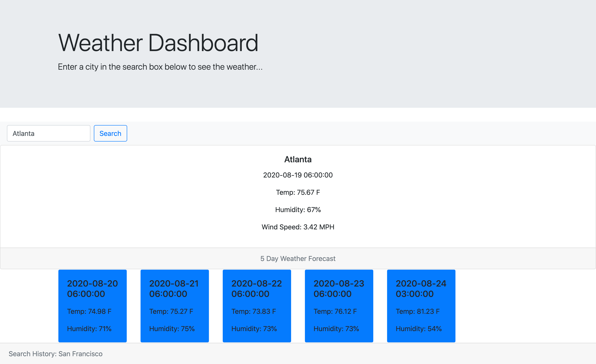

## Weather Dashboard

GIVEN a weather dashboard with a search inputs
WHEN I search for a city
THEN I am presented with current and future conditions for that city
WHEN I view current weather conditions for that city
THEN I am presented with the city name, the date, the temperature, the humidity, the wind speed, and the UV index
WHEN I view future weather conditions for that city
THEN I am presented with a 5-day forecast that displays the date, the temperature, and the humidity
WHEN I open the weather dashboard
THEN I am presented with the last searched city forecast at the bottom of the page in Search History

## Screenshot

## Live Page

https://ssevadjian.github.io/Weather-App/

## GitHub Repository

https://github.com/ssevadjian/Weather-App